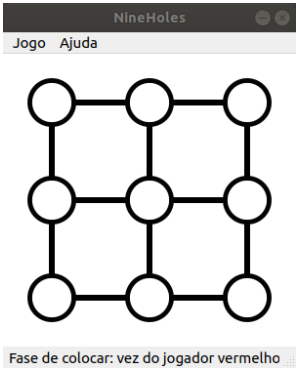

# Trabalho Prático II
## Prof. Andrei Rimsa Álvares

## 1. Objetivo

O objetivo desse trabalho prático é permitir que os alunos pratiquem os
conceitos de programação orientada a eventos em um sistema computacional.
Para isso, será utilizado o framework Qt (https://qt.io/developers) sobre C++
para criação de interfaces gráficas no desenvolvimento de uma aplicação.

## 2. Descrição

Desenvolver um aplicação gráfica que simule o jogo _Nine Holes_
(https://en.wikipedia.org/wiki/Nine_Holes), onde dois jogadores disputam
quem será o vencedor. Cada jogador recebe 3 peças iguais, de uma determinada
cor. O jogo possui um tabuleiro com 9 buracos distribuídos em 3 linhas e 3
colunas (3 x 3), onde essas peças devem ser jogadas. Vence o jogador que formar
suas 3 peças em sequência, na horizontal ou na vertical (na diagonal não vale).
O jogo é dividido em duas fases: a primeira a fase de colocar, a segunda a
fase de mover. A primeira fase começa com o tabuleiro vazio. Os jogadores
alternam jogadas colocando uma peça de cada vez no tabuleiro. Nessa fase, uma
vez que a peça tenha sido colocada no tabuleiro ela não pode ser mais movida.
Esse processo continua até que os dois jogadores tenham colocado todas as suas
peças no tabuleiro. Na segunda fase os jogadores alternam a vez movendo uma
de suas peças para um buraco vazio imediatamente acima, abaixo, a esquerda ou
a direita. Movimentações na diagonal não são permitidas. Vence o jogador que
formar 3 peças na horizontal ou na vertical primeiro. O usuário pode vencer
tanto na primeira quanto na segunda fase.

## 3 . Instruções

O trabalho deve ser feito obrigatoriamente em C++ utilizando o framework Qt (https://qt.io/developers).
O download da API e da IDE podem ser encontradas nesse site. Você deve enviar todo o diretório de trabalho,
que inclui o arquivo de projeto (\*.pro), códigos-fonte (\*.h e \*.cpp), arquivos de design (.ui) e
outros pertinentes. O programa possui uma janela com três componentes:

1. Um menu com três itens:
  * Jogo : selecionar ações relacionadas ao jogo.
    1. Novo : reiniciar o tabuleiro com as peças no lugar original
    2. Sair : fechar o programa.
  * Ajuda : obter informações sobre o jogo.
    1. Sobre : abrir um pop-up ( dialog ) com informações sobre
    o(s) desenvolvedor(es) do trabalho com nome e e-mail.
2. Um tabuleiro central com 9 buracos (3x3).
3. Uma barra de status com indicação em qual fase o jogo está e qual a vez
do jogador.

Um exemplo de tela inicial é dado a seguir:

## 3.1. Gameplay

Após definido o tabuleiro inicial, inicia-se a primeira fase. O jogador 1
(vermelho) deve colocar uma peça no tabuleiro. Depois é a vez do jogador 2
(azul) colocar uma peça. Esse processo continua até que todas as peças sejam
colocadas. Exemplo de configuração após a conclusão da primeira fase:

Assim, inicia-se a segunda fase, que começa com a vez do jogador 1
(vermelho). Esse jogador deve clicar na peça que deseja mover. Na configuração
do exemplo acima, apenas a peça vermelha central pode ser movida, já que é a
única que tem um espaço livre (à direita). Assim, leva-se a configuração a seguir:

Agora é a vez do jogador 2 (azul). Suponha que ele deseje mover a peça
que está na linha do meio e primeira coluna. Nesse caso, existem duas
possibilidades: mover para a direita ou para baixo. O exemplo abaixo (esquerda)
mostra um as duas opções possíveis (fundo verde). O usuário deve então clicar
em uma dessas opções, ou então em outra peça de sua cor para um outro
movimento. O exemplo abaixo (direita) mostra que ele decidiu mover a peça
para baixo:

O jogo continua até que um dos jogares cumpra o objetivo do jogo, formar
3 peças de sua cor em sequência, na horizontal ou vertical (na diagonal não vale).
O exemplo abaixo mostra a vitória do jogador 2 (azul) que formou a sequência na
linha de baixo:

## 4 . Avaliação

O trabalho deve ser feito em grupo de até dois alunos, sendo esse limite superior estrito.
O trabalho será avaliado em 15 pontos, onde essa nota será
multiplicada por um fator entre 0.0 e 1.0 para compor a nota de cada aluno
individualmente. Esse fator poderá estar condicionada a apresentações
presenciais a critério do professor.

Trabalhos copiados, parcialmente ou integralmente, serão avaliados com
nota **ZERO** , sem direito a contestação. Você é responsável pela segurança de seu
código, não podendo alegar que outro grupo o utilizou sem o seu consentimento.

## 5. Submissão

 O trabalho deverá ser submetido até as 23:59 do dia 09/11/2020 (segunda-feira) via sistema acadêmico em pasta específica.
Não serão aceitos, em hipótese alguma, trabalhos enviados por e-mail ou por qualquer outra fonte.
